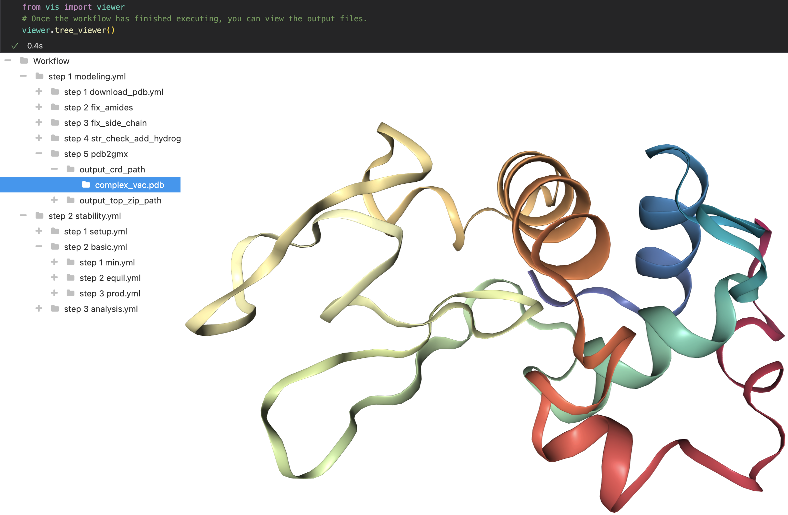

# Molecular Modeling Workflows

This repository contains workflows for various molecular modeling tasks. The workflows can be compiled & executed using the [Workflow Inference Compiler](https://github.com/PolusAI/workflow-inference-compiler).

## Quick Start
Follow the [installation instructions](https://github.com/PolusAI/workflow-inference-compiler#quick-start) here.

## Jupyter notebook visualization

You can view 3D molecular structures in the Jupyter notebook `src/vis/viewer.ipynb`. The visualization currently needs to be in its own conda environment.

```
install/install_conda.sh
conda create --name vis
conda activate vis
install/install_nglview.sh
pip install -e ".[all]"
```


