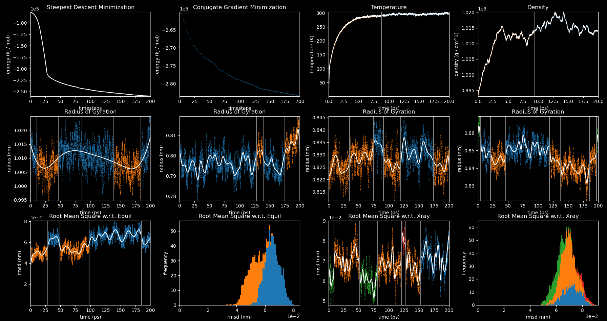

# Molecular Modeling Workflows

This repository contains workflows for various molecular modeling tasks. The workflows can be compiled & executed using the [Workflow Inference Compiler](https://github.com/PolusAI/workflow-inference-compiler).


## Quick Start
First, follow the [installation instructions](https://github.com/PolusAI/workflow-inference-compiler#quick-start) for WIC.

Then, clone this repository and run the following commands:
```
cd install
./install_biobb_adapters.sh
cd ..
mm-workflows --generate_schemas
wic --generate_schemas
```

Some of the workflows require an Nvidia CUDA GPU. Please see the Nvidia [installation guides](https://docs.nvidia.com/cuda/#installation-guides) for more information.
(Moreover, you'll also need to configure it to work with docker. Good luck!)

If all goes well, then you can try running the tutorial, which is based on the following [gromacs tutorial](https://mmb.irbbarcelona.org/biobb/availability/tutorials/cwl).
```
wic --yaml ../mm-workflows/examples/gromacs/tutorial.wic --graphviz --run_local --quiet
```

That last command will infer edges, compile to CWL, generate a GraphViz diagram of the root workflow, and run it locally.

```yaml
label: Conjugate Gradient
steps:
  - grompp:
      in:
        config: !ii
          mdp:
            integrator: cg
            nsteps: 1000
  - mdrun:
      in:
        # Use GPU by default
        bonded_terms: !ii cpu
        pme_terms: !ii cpu
  - gmx_energy:
      in:
        config: !ii
          terms: [Potential]
        output_xvg_path: !ii energy_min_cg.xvg
```
The subworkflow [`examples/gromacs/cg.wic`](https://github.com/PolusAI/mm-workflows/blob/main/examples/gromacs/cg.wic) in `mm-workflows` is shown above, and the GraphViz diagram of the root workflow [`examples/gromacs/tutorial.wic`](https://github.com/PolusAI/mm-workflows/blob/main/examples/gromacs/tutorial.wic) in `mm-workflows` is shown below.


If you add the --parallel flag to the above command then, in another terminal, you can view the plots in real-time:
```
conda activate wic
cd install && ./install_timeseriesplots.sh && cd ..
timeseriesplots
```



## Jupyter notebook visualization

You can view 3D molecular structures in the Jupyter notebook `src/vis/viewer.ipynb`. The visualization currently needs to be in its own conda environment.

```
install/install_conda.sh
conda create --name vis
conda activate vis
install/install_nglview.sh
pip install -e ".[all]"
```


## Visualizing the results

This particular workflow creates files which represent 3D coordinates, so we can view them in the Jupyter notebook `src/vis/viewer.ipynb`. Make sure you are using the `vis` conda environment as mentioned in the installation guide.

